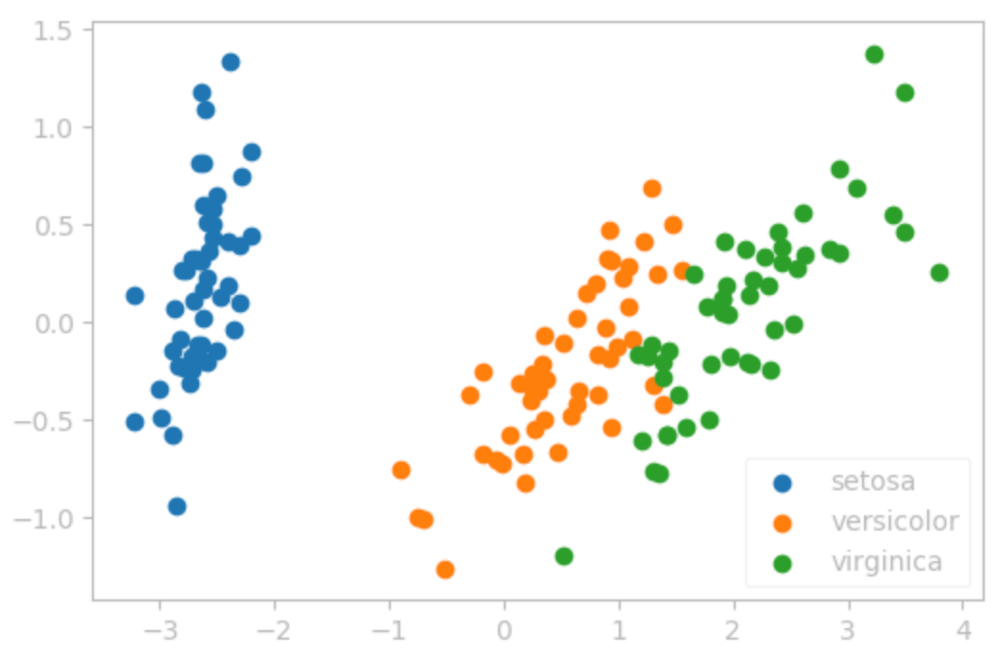
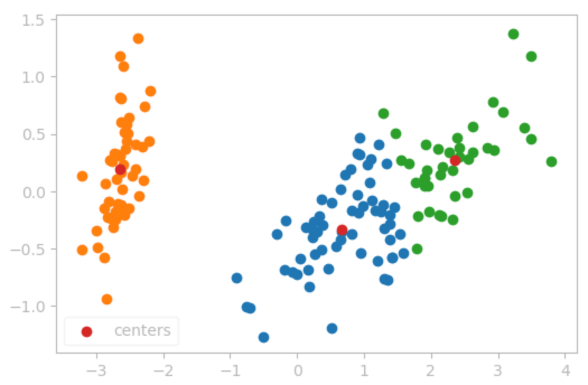
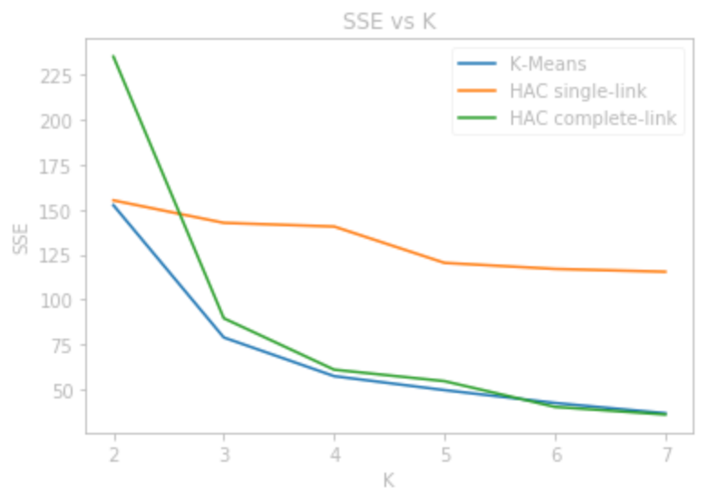
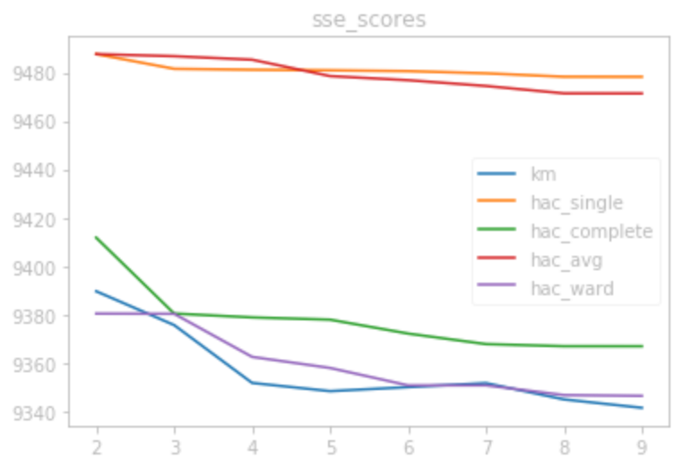
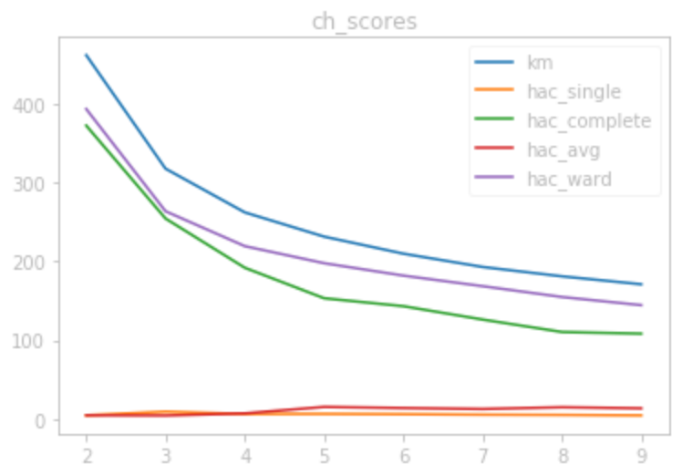

# Clustering

The clustering algorithms we will be exploring in this lab are $`K`$-Means algorithm and Hierarchical Agglomerative Clustering (HAC) algorithm. In general, clustering algorithms attempt to solve the problem of finding clusters of data points or where many points are grouped together. It works best for datasets that have clear clusters of points such as in classification tasks. We would generally expect points of the same classes to be clustered together while points of different classes to be clustered away from each other. 
 $`K`$-Means approach is to initially choose $K$ clusters to divide the data into, then find the optimal $`K`$-clustering through progressively searching for centroids (centers of clusters) that best represent each cluster by minimizing how far each data is to their nearest centroid. On the other hand, HAC initially lets each data point be its own cluster, then progressively merge the two "closest" clusters until there are only $K$ clusters left. There are different ways of defining the closeness of the clusters. Since HAC finds every cluster of size greater than or equal to $K$, it is common to let $K$ be 1 and to build a tree that shows every possible cluster. 

## Code Implementation

### $`K`$-Means

The $`K`$-Means algorithm is initialized by first choosing the $`K`$-centroids. It is best to choose $K$ random points of the dataset to be the initial centroids, but for the purposes of the debug and evaluation tests, we can also choose the first $K$ points of the data to be the initial centroids. We then assign every point of the data to a cluster depending on which centroid it is closest to (usually in terms of Euclidean distance). We then update the centroids as the mean of each cluster, at which point we update the clusters in the same way. We repeat this process until there are no changes in the centroids/clusters or a certain stopping criteria is reached. For my implementation, this stopping criteria is reached when the 2-norm of the difference between the old centroids and the new centroids was less than a tolerance value, which is $10^{-5}$.

### HAC

The HAC algorithm is initialized by letting each of the datapoints be its own cluster. We then merge two closest clusters at a time until there are only $K$ clusters left. There are different ways of defining closeness of clusters. For this lab, only the single-link and complete-link was implemented. Single-link defines the distance between two clusters as the distance between their closest points, whereas complete-link defines it as the maximum distance between two points of the clusters. 

For both options, we first create a distance matrix $D$, where ij element $d_{ij}$ represents the distance between the $i$ and the $j$ data points. We let the diagonal entries be NaN value instead of 0 for ease of computation. For single-link we then simply find the index of the smalles value in the matrix using numpy.nanargmin. Numpy's nanargmin or nanmin functions ignore the NaN values when searching for the minimum. After finding the two closest clusters, we merge them and set every distance between the points in these two cluster to be NaN in the distance matrix. This way, we can ignore the distances that belong in the same cluster. We simply repeat this until we have the desired number of clusters.

The complete-link option is a bit more complicated. We first follow the same procedure as the single-link option until we encounter a cluster with more than one element. We then must recalculate the distance between that cluster and every other cluster. To find this value, we create a submatrix for every possible pair of clusters by taking the rows and columns of the distance matrix that correspond only to the data points that belong to the clusters in interest. For example, let $C_1 = \{x_1, x_2\}$ be a cluster containing $x_1$ and $x_2$ datapoints. These datapoints are represented as an integer. Let $C_2 = \{y_1, y_2, y_3\}$ be a cluster containing $y_1$, $y_2$, and $y_3$ datapoints. The submatrix is formed by taking the $x_1, x_2$ rows and $y_1, y_2, y_3$ columns of the distance matrix. We then find the maximum value of this submatrix, which represents the distance between the i-j cluster. After all of these distances are found, we simply find the minimum of the distances like before and merge the clusters until we only have $K$ clusters. 

For both the $`K`$-Means and HAC, after we converge to the best clusters, we find the calculate how many points belong to each cluster and the SSE of each cluster for output purposes.

### Debug and Evaluation

The functionality of the models was confirmed using the debug set which used the abalone data. The values for the SSE, centroids, and the number of points in each cluster matched exactly with the output provided for all the models.

The models were used for the Evaluation data following the same process as described in the specs. All of the outputs are included in the zip folder containing the code.

## Iris data

The Iris Dataset consists of 50 samples from each of three species of Iris (Iris Setosa, Iris virginica, and Iris versicolor). Four features are measured from each sample: the length and the width of the sepals and petals, in centimeters. The task is to predict the species using these four features. This dataset is perfect as a toy data for clustering since there are only 3 classes and 4 features, and the data points are clustered with respect to its class. Below is a 2 component PCA of Iris data.

  

When training the models, I did not normalize the data since it is already well clustered. I first tried training the $`K`$-Means model with $K=3$ to see how well each clusters are formed. The resulting clustered are transformed using PCA and shown below.

  

The $`K`$-Means model and both the single-link and complete-link HAC models were trained on the data using $K$ ranging between 2 to 7. After the models were trained, we calculated the total SSE values and graphed them against $K$ as shown below. 

  

As can be seen from these graphs, $`K`$-means and HAC with complete-link is able to achieve a pretty small SSE while the single-link struggles to get the SSE below 100. Also, we can see a steep drop in SSE between $K=2$ and $K=3$ and it levels off for higher values of $K$. This shows that the two models were able to identify a good clustering for $K=3$, which is expected of this task with 3 output classes. 

## Scikit-learn's Implementation and Travel Review Data

For the final task, I used the Travel Review data available in the UCI Machine Learning Repository. This data was gathered from TripAdvisor.com. Each datapoint represents a user feedback on a specific location in East Asia. There are 10 features, and each of the features represent the average user feedback in various categories such as restaurants, resorts, and beaches. The users rated each location between 0 (poor) to 4 (excellent), but the average of this value is not provided in the data. However, from this we can expect to see 5 clusters in general. The data was trained using Scikit-learn's implementation of the $`K`$-Means and HAC models, and I used all of the possible linkage options they provided, which include ward, single-link, average-link, and complete-link. I trained each of these models for $K$ ranging between 2 to 9, and scored the quality of each clustering using SSE, silhouette score, Calinski Harabasz score, and Davies Bouldin score, which are all of the available scoring metrics that does not require the true output label. The graph below shows how well each of the models performed based on each of the scoring metrics.

   
   

From these graphs, we can see that the HAC with single-link and average-link tends to do badly in general. This is because both of these have a high tendency to have the "rich gets richer" behavior, where one cluster tends to absorb most of the datapoints. However, these strategies tend to do better with datapoints that are not globular. Therefore for this task, $`K`$-Means and HAC with ward or complete linkage seems to work best. In terms of the metrics, We can see that the SSE for $`K`$-Means and ward linkage doesn't have much change for $K$ value of 4-5. The maximum values for Davies Bouldin score also seems to show when the clustering is best, which seems to be around $K=4$ as well. This makes sense since we were expecting there to be around 5 clusters. For this specific task, it seems that Davies Bouldin score gives us the best metric in evaluating the clusters. This is probably because the Davies Bouldin score calculates gives a score based on the separateness of each of the clusters.

